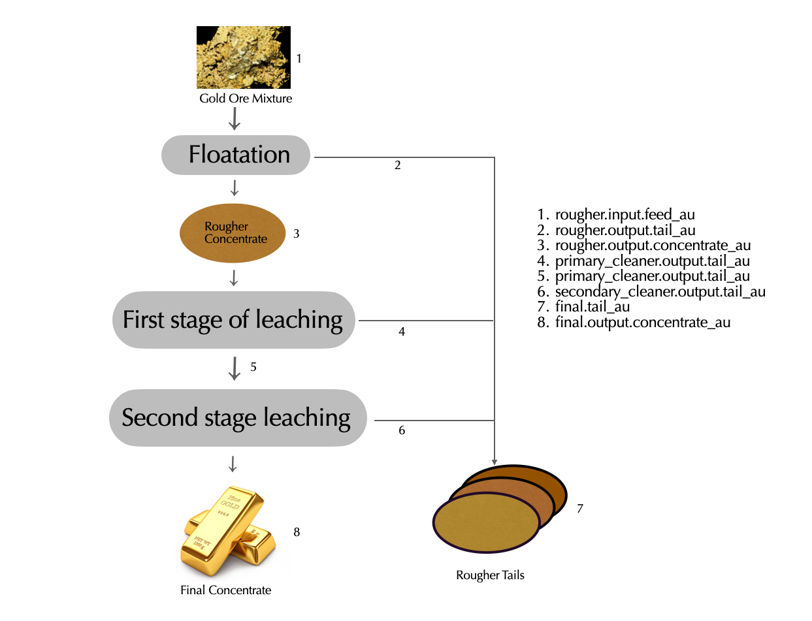
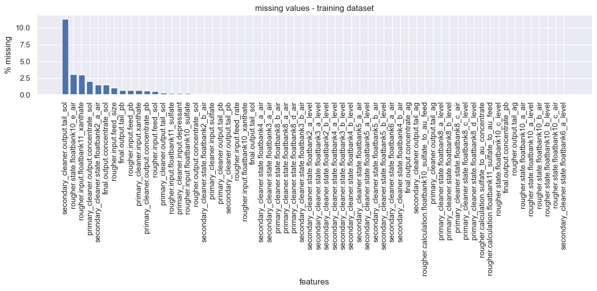
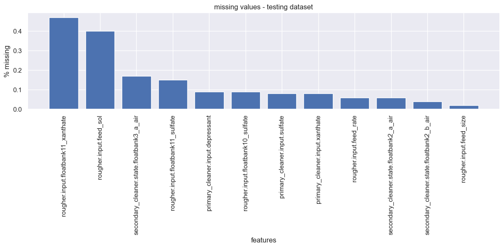
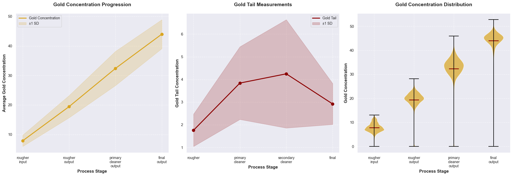
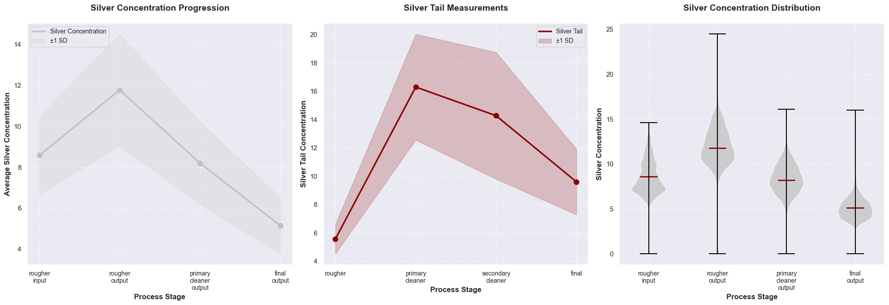
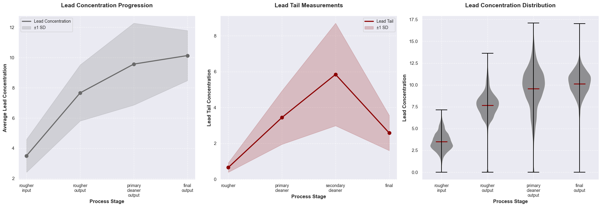
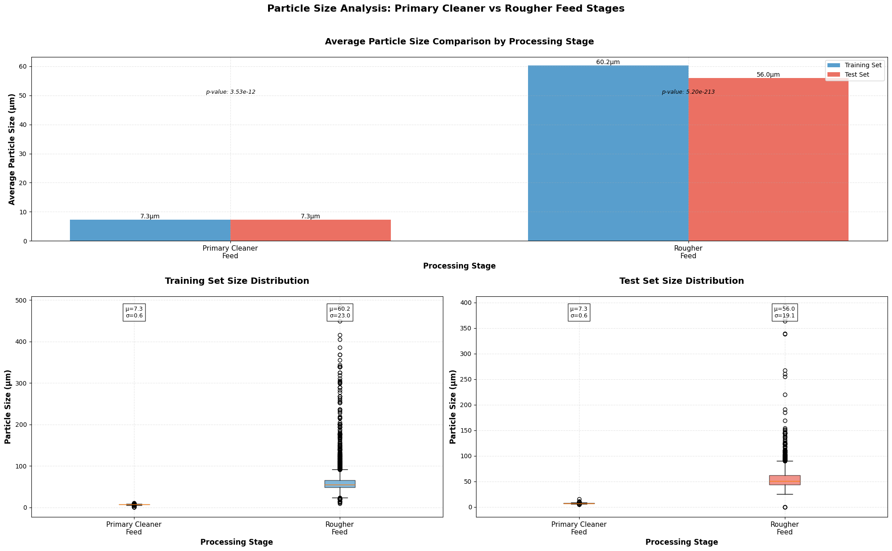
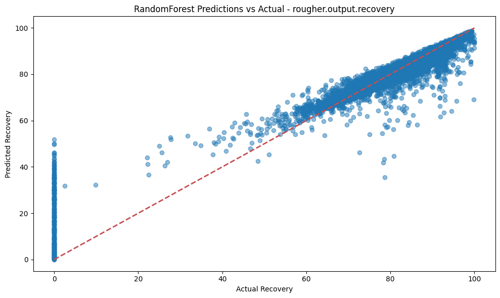
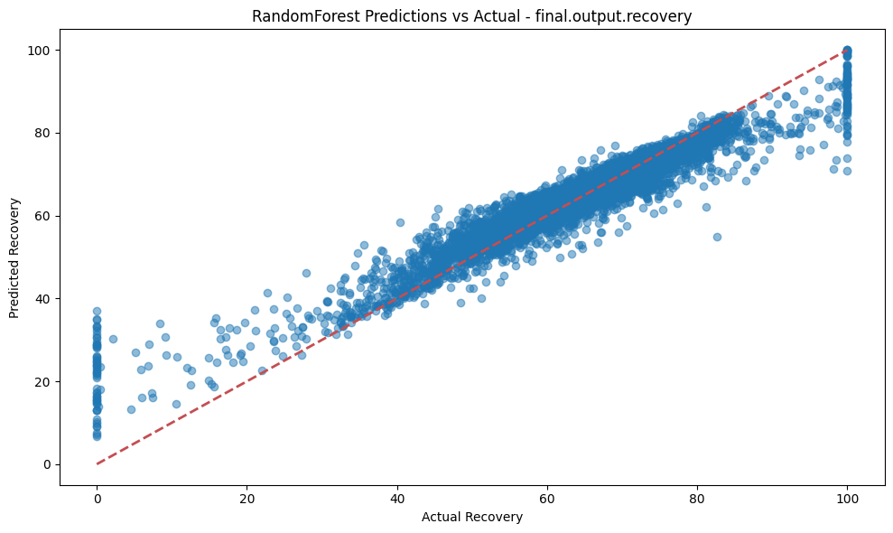

<h2 style="text-align: center;">Machine Learning Integration for Gold Recovery Process Control</h2>

## Table of Contents

 - 1. Introduction
 - 2. Gold Purification Process
 - 3. Data Description
 - 4. Data Quality
 - 5. Data Visualizaiton
 - 6. Model Development
 - 7. Findings and Recommendation


### **Introdction**

In heavy industries, improving efficiency and reducing waste are essential for long-term growth and success. Gold mining, in particular, faces the challenge of extracting as much value as possible from raw materials while keeping processes efficient and cost-effective. To tackle these issues, Zyfra, a company that develops solutions for heavy industries, is turning to machine learning to improve gold ore processing.  

This project aims to use machine learning to predict how much gold can be recovered from ore during the  purification processes.

The primary goals are:
1. Create an accurate digital twin of the purification process. 
2. Enable parameter simulation without production risks. 
3. Optimize reagent consumption and recovery rates. 
4. Provide data-driven insights for process optimization. 

First, lets talk about the opertional process involved in gold purification. 

### **Gold Purification Process**

Gold purification is a multi-stage process used to extract pure gold from ore, focusing on flotation and leaching stages.

#### 1. Flotation Process

Flotation separates gold from gangue based on surface properties. Gold becomes hydrophobic, attaching to air bubbles and floating to the surface, while gangue stays submerged.

#### Flotation Steps:
- Ore is crushed and mixed with water to form a slurry.
- Flotation chemicals are added to separate gold from gangue.
- Air bubbles cause gold to float, forming a froth, which is skimmed off as **rougher concentrate** and fed to the next process, as shown in the figure above.
- Remaining material, **rougher tails**, has a lower gold concentration and is either discarded (as shown in the Fig.1) or further treated.


#### 2. First Stage of Leaching

Cyanidation uses cyanide to dissolve gold from the concentrate into a gold-cyanide complex.

#### Cyanidation Steps:
- Flotation concentrate is mixed with sodium cyanide.
- Cyanide leaches gold into a liquid form, separating it from gangue.

#### 3. Second Stage of Leaching

Gold is recovered from the cyanide solution using activated carbon or zinc.

#### Activated Carbon Adsorption:
- Cyanide solution is passed through activated carbon, adsorbing gold.
- Gold is stripped from the carbon and refined.

#### Zinc Precipitation:
- Zinc is added to the cyanide solution, causing gold to precipitate.
- Gold is filtered out and refined.

The following image visually represents the gold recovery process workflow, highlighting stages like flotation, primary purification, secondary purification, and final product characteristics. It also uses example variables to illustrate how data corresponds to stages and parameter types, such as gold content.

<div align="center">

<figcaption style="text-align: center; font-style: italic; margin-top: 10px;">
        Figure 1: The image visually represents the gold recovery process workflow, highlighting stages like flotation, primary purification, secondary purification, and final product characteristics. It also uses example variables to illustrate how data corresponds to stages and parameter types, such as gold content.
</figcaption>

</div>

### **Data Description**

Throughout the gold recovery process, the dataset captures a comprehensive set of measurements taken at various purification stages. These include metal concentrations (Gold, Silver, Lead), particle size distributions, process-specific parameters, and time-series measurements. Each data point is tagged with a timestamp, enabling temporal analysis to identify trends, patterns, and potential optimizations in the recovery process. This time-based dimension adds valuable context for understanding how process parameters evolve and influence recovery efficiency over time.


Each data point is tagged with a timestamp, enabling temporal analysis to identify trends, patterns, and potential optimizations in the recovery process. This time-based dimension adds valuable context for understanding how process parameters evolve and influence recovery efficiency over time.

The column names in the dataset follow the structure:

```
[stage].[parameter_type].[parameter_name]
```
Where:

- **[stage]** refers to the specific stage in the process:
  - `rougher` — flotation stage
  - `primary_cleaner` — primary purification stage
  - `secondary_cleaner` — secondary purification stage
  - `final` — final product characteristics

- **[parameter_type]** refers to the type of the parameter:
  - `input` — raw material parameters
  - `output` — product parameters
  - `state` — parameters that characterize the current state of the stage
  - `calculation` — derived or calculation-based parameters

- **[parameter_name]** refers to the specific parameter being measured. For a full description, refer to the [`parameter_names.md`](command:_github.copilot.openRelativePath?%5B%22goldrecovery%2Fdata%2Fparameter_names.md%22%5D "goldrecovery/data/parameter_names.md") file.


#### **Initialization**


```python
import warnings

import matplotlib.pyplot as plt
import numpy as np
import pandas as pd
import seaborn as sns
from lightgbm import LGBMRegressor
from matplotlib.gridspec import GridSpec
from scipy.stats import ks_2samp
from sklearn.ensemble import RandomForestRegressor
from sklearn.inspection import partial_dependence
from sklearn.metrics import make_scorer, mean_absolute_error, r2_score
from sklearn.model_selection import GridSearchCV, train_test_split
from sklearn.preprocessing import MinMaxScaler, StandardScaler
from xgboost import XGBRegressor

warnings.filterwarnings("ignore")
```

#### **Loading Data**
Loading and looking through the data... 


```python
# load Data
train_df = pd.read_csv("../data/gold_recovery_train_new.csv")
test_df = pd.read_csv("../data/gold_recovery_test_new.csv")
full_df = pd.read_csv("../data/gold_recovery_full_new.csv")

# display basic information from training data
print("Training set shape:", train_df.shape)
print("Test set shape:", test_df.shape)
print("Full set shape:", full_df.shape)
print("\nTraining Dataset Info:")
train_df.info()
print("\nFirst few rows of training data:")
display(train_df.head())
print("\nMissing values in training data:")
print(train_df.isnull().sum())
# print("\nStatistical description of training data:")
# display(train_df.describe())
```

    Training set shape: (14149, 87)
    Test set shape: (5290, 53)
    Full set shape: (19439, 87)
    
    Training Dataset Info:
    <class 'pandas.core.frame.DataFrame'>
    RangeIndex: 14149 entries, 0 to 14148
    Data columns (total 87 columns):
     #   Column                                              Non-Null Count  Dtype  
    ---  ------                                              --------------  -----  
     0   date                                                14149 non-null  object 
     1   final.output.concentrate_ag                         14148 non-null  float64
     2   final.output.concentrate_pb                         14148 non-null  float64
     3   final.output.concentrate_sol                        13938 non-null  float64
     4   final.output.concentrate_au                         14149 non-null  float64
     5   final.output.recovery                               14149 non-null  float64
     6   final.output.tail_ag                                14149 non-null  float64
     7   final.output.tail_pb                                14049 non-null  float64
     8   final.output.tail_sol                               14144 non-null  float64
     9   final.output.tail_au                                14149 non-null  float64
     10  primary_cleaner.input.sulfate                       14129 non-null  float64
     11  primary_cleaner.input.depressant                    14117 non-null  float64
     12  primary_cleaner.input.feed_size                     14149 non-null  float64
     13  primary_cleaner.input.xanthate                      14049 non-null  float64
     14  primary_cleaner.output.concentrate_ag               14149 non-null  float64
     15  primary_cleaner.output.concentrate_pb               14063 non-null  float64
     16  primary_cleaner.output.concentrate_sol              13863 non-null  float64
     17  primary_cleaner.output.concentrate_au               14149 non-null  float64
     18  primary_cleaner.output.tail_ag                      14148 non-null  float64
     19  primary_cleaner.output.tail_pb                      14134 non-null  float64
     20  primary_cleaner.output.tail_sol                     14103 non-null  float64
     21  primary_cleaner.output.tail_au                      14149 non-null  float64
     22  primary_cleaner.state.floatbank8_a_air              14145 non-null  float64
     23  primary_cleaner.state.floatbank8_a_level            14148 non-null  float64
     24  primary_cleaner.state.floatbank8_b_air              14145 non-null  float64
     25  primary_cleaner.state.floatbank8_b_level            14148 non-null  float64
     26  primary_cleaner.state.floatbank8_c_air              14147 non-null  float64
     27  primary_cleaner.state.floatbank8_c_level            14148 non-null  float64
     28  primary_cleaner.state.floatbank8_d_air              14146 non-null  float64
     29  primary_cleaner.state.floatbank8_d_level            14148 non-null  float64
     30  rougher.calculation.sulfate_to_au_concentrate       14148 non-null  float64
     31  rougher.calculation.floatbank10_sulfate_to_au_feed  14148 non-null  float64
     32  rougher.calculation.floatbank11_sulfate_to_au_feed  14148 non-null  float64
     33  rougher.calculation.au_pb_ratio                     14149 non-null  float64
     34  rougher.input.feed_ag                               14149 non-null  float64
     35  rougher.input.feed_pb                               14049 non-null  float64
     36  rougher.input.feed_rate                             14141 non-null  float64
     37  rougher.input.feed_size                             14005 non-null  float64
     38  rougher.input.feed_sol                              14071 non-null  float64
     39  rougher.input.feed_au                               14149 non-null  float64
     40  rougher.input.floatbank10_sulfate                   14120 non-null  float64
     41  rougher.input.floatbank10_xanthate                  14141 non-null  float64
     42  rougher.input.floatbank11_sulfate                   14113 non-null  float64
     43  rougher.input.floatbank11_xanthate                  13721 non-null  float64
     44  rougher.output.concentrate_ag                       14149 non-null  float64
     45  rougher.output.concentrate_pb                       14149 non-null  float64
     46  rougher.output.concentrate_sol                      14127 non-null  float64
     47  rougher.output.concentrate_au                       14149 non-null  float64
     48  rougher.output.recovery                             14149 non-null  float64
     49  rougher.output.tail_ag                              14148 non-null  float64
     50  rougher.output.tail_pb                              14149 non-null  float64
     51  rougher.output.tail_sol                             14149 non-null  float64
     52  rougher.output.tail_au                              14149 non-null  float64
     53  rougher.state.floatbank10_a_air                     14148 non-null  float64
     54  rougher.state.floatbank10_a_level                   14148 non-null  float64
     55  rougher.state.floatbank10_b_air                     14148 non-null  float64
     56  rougher.state.floatbank10_b_level                   14148 non-null  float64
     57  rougher.state.floatbank10_c_air                     14148 non-null  float64
     58  rougher.state.floatbank10_c_level                   14148 non-null  float64
     59  rougher.state.floatbank10_d_air                     14149 non-null  float64
     60  rougher.state.floatbank10_d_level                   14149 non-null  float64
     61  rougher.state.floatbank10_e_air                     13713 non-null  float64
     62  rougher.state.floatbank10_e_level                   14149 non-null  float64
     63  rougher.state.floatbank10_f_air                     14149 non-null  float64
     64  rougher.state.floatbank10_f_level                   14149 non-null  float64
     65  secondary_cleaner.output.tail_ag                    14147 non-null  float64
     66  secondary_cleaner.output.tail_pb                    14139 non-null  float64
     67  secondary_cleaner.output.tail_sol                   12544 non-null  float64
     68  secondary_cleaner.output.tail_au                    14149 non-null  float64
     69  secondary_cleaner.state.floatbank2_a_air            13932 non-null  float64
     70  secondary_cleaner.state.floatbank2_a_level          14148 non-null  float64
     71  secondary_cleaner.state.floatbank2_b_air            14128 non-null  float64
     72  secondary_cleaner.state.floatbank2_b_level          14148 non-null  float64
     73  secondary_cleaner.state.floatbank3_a_air            14145 non-null  float64
     74  secondary_cleaner.state.floatbank3_a_level          14148 non-null  float64
     75  secondary_cleaner.state.floatbank3_b_air            14148 non-null  float64
     76  secondary_cleaner.state.floatbank3_b_level          14148 non-null  float64
     77  secondary_cleaner.state.floatbank4_a_air            14143 non-null  float64
     78  secondary_cleaner.state.floatbank4_a_level          14148 non-null  float64
     79  secondary_cleaner.state.floatbank4_b_air            14148 non-null  float64
     80  secondary_cleaner.state.floatbank4_b_level          14148 non-null  float64
     81  secondary_cleaner.state.floatbank5_a_air            14148 non-null  float64
     82  secondary_cleaner.state.floatbank5_a_level          14148 non-null  float64
     83  secondary_cleaner.state.floatbank5_b_air            14148 non-null  float64
     84  secondary_cleaner.state.floatbank5_b_level          14148 non-null  float64
     85  secondary_cleaner.state.floatbank6_a_air            14147 non-null  float64
     86  secondary_cleaner.state.floatbank6_a_level          14148 non-null  float64
    dtypes: float64(86), object(1)
    memory usage: 9.4+ MB
    
    First few rows of training data:


<div>
<style scoped>
    .dataframe tbody tr th:only-of-type {
        vertical-align: middle;
    }

    .dataframe tbody tr th {
        vertical-align: top;
    }

    .dataframe thead th {
        text-align: right;
    }
</style>
<table border="1" class="dataframe">
  <thead>
    <tr style="text-align: right;">
      <th></th>
      <th>date</th>
      <th>final.output.concentrate_ag</th>
      <th>final.output.concentrate_pb</th>
      <th>final.output.concentrate_sol</th>
      <th>final.output.concentrate_au</th>
      <th>final.output.recovery</th>
      <th>final.output.tail_ag</th>
      <th>final.output.tail_pb</th>
      <th>final.output.tail_sol</th>
      <th>final.output.tail_au</th>
      <th>...</th>
      <th>secondary_cleaner.state.floatbank4_a_air</th>
      <th>secondary_cleaner.state.floatbank4_a_level</th>
      <th>secondary_cleaner.state.floatbank4_b_air</th>
      <th>secondary_cleaner.state.floatbank4_b_level</th>
      <th>secondary_cleaner.state.floatbank5_a_air</th>
      <th>secondary_cleaner.state.floatbank5_a_level</th>
      <th>secondary_cleaner.state.floatbank5_b_air</th>
      <th>secondary_cleaner.state.floatbank5_b_level</th>
      <th>secondary_cleaner.state.floatbank6_a_air</th>
      <th>secondary_cleaner.state.floatbank6_a_level</th>
    </tr>
  </thead>
  <tbody>
    <tr>
      <th>0</th>
      <td>2016-01-15 00:00:00</td>
      <td>6.055403</td>
      <td>9.889648</td>
      <td>5.507324</td>
      <td>42.192020</td>
      <td>70.541216</td>
      <td>10.411962</td>
      <td>0.895447</td>
      <td>16.904297</td>
      <td>2.143149</td>
      <td>...</td>
      <td>14.016835</td>
      <td>-502.488007</td>
      <td>12.099931</td>
      <td>-504.715942</td>
      <td>9.925633</td>
      <td>-498.310211</td>
      <td>8.079666</td>
      <td>-500.470978</td>
      <td>14.151341</td>
      <td>-605.841980</td>
    </tr>
    <tr>
      <th>1</th>
      <td>2016-01-15 01:00:00</td>
      <td>6.029369</td>
      <td>9.968944</td>
      <td>5.257781</td>
      <td>42.701629</td>
      <td>69.266198</td>
      <td>10.462676</td>
      <td>0.927452</td>
      <td>16.634514</td>
      <td>2.224930</td>
      <td>...</td>
      <td>13.992281</td>
      <td>-505.503262</td>
      <td>11.950531</td>
      <td>-501.331529</td>
      <td>10.039245</td>
      <td>-500.169983</td>
      <td>7.984757</td>
      <td>-500.582168</td>
      <td>13.998353</td>
      <td>-599.787184</td>
    </tr>
    <tr>
      <th>2</th>
      <td>2016-01-15 02:00:00</td>
      <td>6.055926</td>
      <td>10.213995</td>
      <td>5.383759</td>
      <td>42.657501</td>
      <td>68.116445</td>
      <td>10.507046</td>
      <td>0.953716</td>
      <td>16.208849</td>
      <td>2.257889</td>
      <td>...</td>
      <td>14.015015</td>
      <td>-502.520901</td>
      <td>11.912783</td>
      <td>-501.133383</td>
      <td>10.070913</td>
      <td>-500.129135</td>
      <td>8.013877</td>
      <td>-500.517572</td>
      <td>14.028663</td>
      <td>-601.427363</td>
    </tr>
    <tr>
      <th>3</th>
      <td>2016-01-15 03:00:00</td>
      <td>6.047977</td>
      <td>9.977019</td>
      <td>4.858634</td>
      <td>42.689819</td>
      <td>68.347543</td>
      <td>10.422762</td>
      <td>0.883763</td>
      <td>16.532835</td>
      <td>2.146849</td>
      <td>...</td>
      <td>14.036510</td>
      <td>-500.857308</td>
      <td>11.999550</td>
      <td>-501.193686</td>
      <td>9.970366</td>
      <td>-499.201640</td>
      <td>7.977324</td>
      <td>-500.255908</td>
      <td>14.005551</td>
      <td>-599.996129</td>
    </tr>
    <tr>
      <th>4</th>
      <td>2016-01-15 04:00:00</td>
      <td>6.148599</td>
      <td>10.142511</td>
      <td>4.939416</td>
      <td>42.774141</td>
      <td>66.927016</td>
      <td>10.360302</td>
      <td>0.792826</td>
      <td>16.525686</td>
      <td>2.055292</td>
      <td>...</td>
      <td>14.027298</td>
      <td>-499.838632</td>
      <td>11.953070</td>
      <td>-501.053894</td>
      <td>9.925709</td>
      <td>-501.686727</td>
      <td>7.894242</td>
      <td>-500.356035</td>
      <td>13.996647</td>
      <td>-601.496691</td>
    </tr>
  </tbody>
</table>
<p>5 rows × 87 columns</p>
</div>


    
    Missing values in training data:
    date                                            0
    final.output.concentrate_ag                     1
    final.output.concentrate_pb                     1
    final.output.concentrate_sol                  211
    final.output.concentrate_au                     0
                                                 ... 
    secondary_cleaner.state.floatbank5_a_level      1
    secondary_cleaner.state.floatbank5_b_air        1
    secondary_cleaner.state.floatbank5_b_level      1
    secondary_cleaner.state.floatbank6_a_air        2
    secondary_cleaner.state.floatbank6_a_level      1
    Length: 87, dtype: int64


Looking at the output, we can observe that the test dataset has 53 columns, while the training dataset contains 87 columns. This discrepancy arises because some parameters were measured or calculated later on. Let’s take a closer look at which columns are missing.

### **Data Quality**

Now that we understand what the data represents and have successfully loaded it, we noticed a discrepancy in the shapes of the training and test sets. Ensuring data quality is crucial, as it directly impacts the model’s ability to learn effectively and make accurate predictions. Therefore, a thorough inspection of the dataset is essential to identify any inconsistencies, missing values, or anomalies that could affect model performance.

Lets start by comparing the columns of the data betweeen the test set and train set. 


```python
# analyze the differences between train and test datasets
missing_cols = sorted(list(set(train_df.columns) - set(test_df.columns)))

# categorize missing columns by their types
missing_by_stage = {
    "rougher": [],
    "primary_cleaner": [],
    "secondary_cleaner": [],
    "final": [],
}

for col in missing_cols:
    stage = col.split(".")[0]
    missing_by_stage[stage].append(col)

# display missing columns by stage
print("\nMissing columns by processing stage:")
for stage, cols in missing_by_stage.items():
    print(f"\n{stage.upper()} stage missing columns ({len(cols)}):")
    for col in cols:
        print(f"- {col}")
```

    
    Missing columns by processing stage:
    
    ROUGHER stage missing columns (13):
    - rougher.calculation.au_pb_ratio
    - rougher.calculation.floatbank10_sulfate_to_au_feed
    - rougher.calculation.floatbank11_sulfate_to_au_feed
    - rougher.calculation.sulfate_to_au_concentrate
    - rougher.output.concentrate_ag
    - rougher.output.concentrate_au
    - rougher.output.concentrate_pb
    - rougher.output.concentrate_sol
    - rougher.output.recovery
    - rougher.output.tail_ag
    - rougher.output.tail_au
    - rougher.output.tail_pb
    - rougher.output.tail_sol
    
    PRIMARY_CLEANER stage missing columns (8):
    - primary_cleaner.output.concentrate_ag
    - primary_cleaner.output.concentrate_au
    - primary_cleaner.output.concentrate_pb
    - primary_cleaner.output.concentrate_sol
    - primary_cleaner.output.tail_ag
    - primary_cleaner.output.tail_au
    - primary_cleaner.output.tail_pb
    - primary_cleaner.output.tail_sol
    
    SECONDARY_CLEANER stage missing columns (4):
    - secondary_cleaner.output.tail_ag
    - secondary_cleaner.output.tail_au
    - secondary_cleaner.output.tail_pb
    - secondary_cleaner.output.tail_sol
    
    FINAL stage missing columns (9):
    - final.output.concentrate_ag
    - final.output.concentrate_au
    - final.output.concentrate_pb
    - final.output.concentrate_sol
    - final.output.recovery
    - final.output.tail_ag
    - final.output.tail_au
    - final.output.tail_pb
    - final.output.tail_sol


Most of these missing columns are 'output' parameters that would not be available in a real-world prediction scenario. 

#### Missing Parameters Include:
1. Recovery rates at different stages
2. Concentrate and tail characteristics
3. Final product parameters

With a clear understanding of the differences between the training and test sets, the next step is to analyze the dataset further. We’ll assess data quality by identifying any missing values, inconsistencies, or abnormalities that could impact the model’s performance.


```python
def analyze_missing_values(df, name):
    """analyze missing values and their patterns in the dataset"""
    print(f"\n{'='*50}")
    print(f"missing values analysis for {name} dataset")
    print(f"{'='*50}")

    # get basic missing value stats
    missing_vals = df.isnull().sum()
    missing_pct = (missing_vals / len(df)) * 100

    # create summary dataframe
    missing_info = pd.DataFrame(
        {"missing_count": missing_vals, "percent_missing": missing_pct.round(2)}
    )

    # look at features with missing values
    missing_features = missing_info[missing_info["missing_count"] > 0].sort_values(
        "percent_missing", ascending=False
    )

    if len(missing_features) > 0:
        print(f"\nfound {len(missing_features)} features with missing values:")
        display(missing_features)

        # quick summary stats
        print("\nsummary:")
        print(f"total missing values: {missing_vals.sum():,}")
        print(f"average missing: {missing_pct.mean():.2f}%")
        print(
            f"features with >50% missing: {len(missing_features[missing_features['percent_missing'] > 50])}"
        )

        # visualize missing value distribution
        plt.figure(figsize=(12, 6))
        plt.bar(range(len(missing_features)), missing_features["percent_missing"])
        plt.title(f"missing values - {name} dataset")
        plt.xlabel("features")
        plt.ylabel("% missing")
        plt.xticks(range(len(missing_features)), missing_features.index, rotation=90)
        plt.tight_layout()
        plt.show()
    else:
        print("\nno missing values found in the dataset")


# check both datasets
analyze_missing_values(train_df, "training")
analyze_missing_values(test_df, "testing")

# TODO: Check the co-relation between the missing values and then visualize the output
```

    
    ==================================================
    missing values analysis for training dataset
    ==================================================
    
    found 62 features with missing values:


<div>
<style scoped>
    .dataframe tbody tr th:only-of-type {
        vertical-align: middle;
    }

    .dataframe tbody tr th {
        vertical-align: top;
    }

    .dataframe thead th {
        text-align: right;
    }
</style>
<table border="1" class="dataframe">
  <thead>
    <tr style="text-align: right;">
      <th></th>
      <th>missing_count</th>
      <th>percent_missing</th>
    </tr>
  </thead>
  <tbody>
    <tr>
      <th>secondary_cleaner.output.tail_sol</th>
      <td>1605</td>
      <td>11.34</td>
    </tr>
    <tr>
      <th>rougher.state.floatbank10_e_air</th>
      <td>436</td>
      <td>3.08</td>
    </tr>
    <tr>
      <th>rougher.input.floatbank11_xanthate</th>
      <td>428</td>
      <td>3.02</td>
    </tr>
    <tr>
      <th>primary_cleaner.output.concentrate_sol</th>
      <td>286</td>
      <td>2.02</td>
    </tr>
    <tr>
      <th>secondary_cleaner.state.floatbank2_a_air</th>
      <td>217</td>
      <td>1.53</td>
    </tr>
    <tr>
      <th>...</th>
      <td>...</td>
      <td>...</td>
    </tr>
    <tr>
      <th>rougher.state.floatbank10_a_level</th>
      <td>1</td>
      <td>0.01</td>
    </tr>
    <tr>
      <th>rougher.state.floatbank10_b_air</th>
      <td>1</td>
      <td>0.01</td>
    </tr>
    <tr>
      <th>rougher.state.floatbank10_b_level</th>
      <td>1</td>
      <td>0.01</td>
    </tr>
    <tr>
      <th>rougher.state.floatbank10_c_air</th>
      <td>1</td>
      <td>0.01</td>
    </tr>
    <tr>
      <th>secondary_cleaner.state.floatbank6_a_level</th>
      <td>1</td>
      <td>0.01</td>
    </tr>
  </tbody>
</table>
<p>62 rows × 2 columns</p>
</div>


    
    summary:
    total missing values: 4,100
    average missing: 0.33%
    features with >50% missing: 0


    

    


    
    ==================================================
    missing values analysis for testing dataset
    ==================================================
    
    found 12 features with missing values:


<div>
<style scoped>
    .dataframe tbody tr th:only-of-type {
        vertical-align: middle;
    }

    .dataframe tbody tr th {
        vertical-align: top;
    }

    .dataframe thead th {
        text-align: right;
    }
</style>
<table border="1" class="dataframe">
  <thead>
    <tr style="text-align: right;">
      <th></th>
      <th>missing_count</th>
      <th>percent_missing</th>
    </tr>
  </thead>
  <tbody>
    <tr>
      <th>rougher.input.floatbank11_xanthate</th>
      <td>25</td>
      <td>0.47</td>
    </tr>
    <tr>
      <th>rougher.input.feed_sol</th>
      <td>21</td>
      <td>0.40</td>
    </tr>
    <tr>
      <th>secondary_cleaner.state.floatbank3_a_air</th>
      <td>9</td>
      <td>0.17</td>
    </tr>
    <tr>
      <th>rougher.input.floatbank11_sulfate</th>
      <td>8</td>
      <td>0.15</td>
    </tr>
    <tr>
      <th>primary_cleaner.input.depressant</th>
      <td>5</td>
      <td>0.09</td>
    </tr>
    <tr>
      <th>rougher.input.floatbank10_sulfate</th>
      <td>5</td>
      <td>0.09</td>
    </tr>
    <tr>
      <th>primary_cleaner.input.sulfate</th>
      <td>4</td>
      <td>0.08</td>
    </tr>
    <tr>
      <th>primary_cleaner.input.xanthate</th>
      <td>4</td>
      <td>0.08</td>
    </tr>
    <tr>
      <th>rougher.input.feed_rate</th>
      <td>3</td>
      <td>0.06</td>
    </tr>
    <tr>
      <th>secondary_cleaner.state.floatbank2_a_air</th>
      <td>3</td>
      <td>0.06</td>
    </tr>
    <tr>
      <th>secondary_cleaner.state.floatbank2_b_air</th>
      <td>2</td>
      <td>0.04</td>
    </tr>
    <tr>
      <th>rougher.input.feed_size</th>
      <td>1</td>
      <td>0.02</td>
    </tr>
  </tbody>
</table>
</div>


    
    summary:
    total missing values: 90
    average missing: 0.03%
    features with >50% missing: 0


    

    


The missing values analysis reveals a notable difference between the training and testing datasets. The training dataset has 4,100 missing values spread across 62 features, with an average missing rate of 0.33%. In contrast, the testing dataset contains significantly fewer missing values—only 90 across 12 features, with an average missing rate of 0.03%.
While no features have more than 50% missing data, certain key parameters, such as secondary cleaner output tail solution and rougher state variables, exhibit higher missing percentages in the training set. This discrepancy suggests that careful handling of missing values is necessary to ensure data integrity and model reliability. 

#### Handling Missing Values

 Since our data is time-series based with timestamps, we'll use a two-step imputation strategy to deal with the missing values in our dataset. 

1. Forward Fill (ffill):
   - Fills missing values using the last known value
   - Works well for time series as it assumes the process continues with the last known state
   - Particularly useful for continuous process parameters

2. Backward Fill (bfill):
   - Applied after forward fill to handle any remaining gaps
   - Fills missing values using the next known value
   - Acts as a backup strategy for gaps at the beginning of the dataset

This combined approach is appropriate because:
- Process parameters typically change gradually over time
- Using both fills ensures we don't leave any gaps
- The temporal order is preserved by sorting by timestamp first
- We maintain the natural flow of the process parameters

Key considerations in our implementation:
- We only apply this to feature columns (X variables)
- Target variables (recovery values) remain untouched
- Train and test sets are handled separately to prevent data leakage

Let's implement this strategy:


```python
# identify target columns (y variables)
target_cols = [col for col in train_df.columns if "recovery" in col]
print("target columns:")
for col in target_cols:
    print(f"- {col}")


def fill_missing_values(df, name):
    """fill missing values using forward fill, then backward fill"""
    df_filled = df.copy()
    feature_cols = [col for col in df.columns if col not in target_cols]
    df_filled = df_filled.sort_values("date")
    df_filled[feature_cols] = df_filled[feature_cols].ffill().bfill()

    return df_filled


# apply the strategy to train and test sets
print("\nfilling missing values...")
train_cleaned = fill_missing_values(train_df, "training")
test_cleaned = fill_missing_values(test_df, "test")
full_cleaned = fill_missing_values(full_df, "full")

# verify results


def check_missing_after_fill(df, name):
    """verify no missing values remain in features"""
    missing = df.isnull().sum()
    missing = missing[missing > 0]

    if len(missing) > 0:
        print(f"\nremaining missing values in {name} set:")
        print(missing)
    else:
        print(f"\nno missing values remain in {name} set features")


# check results for both datasets
check_missing_after_fill(train_cleaned, "training")
check_missing_after_fill(test_cleaned, "test")

# quick verification of data shape
print("\nshapes after cleaning:")
print(f"training: {train_cleaned.shape}")
print(f"test: {test_cleaned.shape}")
```

    target columns:
    - final.output.recovery
    - rougher.output.recovery
    
    filling missing values...
    
    no missing values remain in training set features
    
    no missing values remain in test set features
    
    shapes after cleaning:
    training: (14149, 87)
    test: (5290, 53)


### **Data Visualization**
Now that we have improved the quality of the data, it is essential to verify whether the collected data aligns with the expected trends in gold purification. Simply having clean data is not enough—we need to ensure that it accurately represents the underlying process.

In the gold purification process, we expect the metal concentration to increase at each stage. Visualizing the concentration levels at different processing steps should confirm whether this trend holds. Additionally, given the discrepancies between the training and test datasets, it is important to compare the particle size distributions in both sets. This will help ensure that the physical properties of the materials are consistent, preventing potential biases in model training and evaluation.

### Metal Concentration Visuzlaization

Lets first analyze the concentration patterns of three key metals (Gold, Silver, and Lead) across different stages of the process.

We visualize three key aspects for each metal:
1. **Concentration Progression**: Shows how the metal concentration changes through different stages
2. **Tail Measurements**: Tracks the metal content in the waste material (tails)
3. **Distribution Analysis**: Displays the statistical distribution of concentrations at each stage


```python
def analyze_metal_concentration(df, metal):
    """analyze concentration of a specific metal across purification stages"""

    # define stages and their required columns
    stage_columns = {
        "rougher": {
            "input": f"rougher.input.feed_{metal}",
            "output": f"rougher.output.concentrate_{metal}",
        },
        "primary_cleaner": {"output": f"primary_cleaner.output.concentrate_{metal}"},
        "secondary_cleaner": {
            "output": f"secondary_cleaner.output.concentrate_{metal}"
        },
        "final": {"output": f"final.output.concentrate_{metal}"},
    }

    # create dictionaries to store data
    concentrations = []
    stage_names = []
    distributions = {}

    # metal-specific colors and names
    metal_colors = {
        "au": ("goldenrod", "Gold"),
        "ag": ("silver", "Silver"),
        "pb": ("dimgray", "Lead"),
    }
    color, metal_name = metal_colors[metal]

    # collect data for each stage
    for stage, columns in stage_columns.items():
        for step_type, column in columns.items():
            if column in df.columns:
                concentrations.append(df[column].mean())
                stage_names.append(f"{stage}_{step_type}")
                distributions[f"{stage}_{step_type}"] = df[column]

    # collect tail data
    tail_data = []
    tail_labels = []
    for stage in ["rougher", "primary_cleaner", "secondary_cleaner", "final"]:
        tail_col = f"{stage}.output.tail_{metal}"
        if tail_col in df.columns:
            tail_data.append(df[tail_col].mean())
            tail_labels.append(stage)

    # create visualization with 3 subplots
    fig = plt.figure(figsize=(20, 7))
    gs = GridSpec(1, 3, width_ratios=[1, 1, 1], figure=fig)

    # plot 1: Concentration changes
    ax1 = fig.add_subplot(gs[0])
    points = np.array(concentrations)
    x = range(len(points))

    # plot trend line
    ax1.plot(
        x, points, "-", linewidth=2.5, color=color, label=f"{metal_name} Concentration"
    )
    ax1.plot(x, points, "o", markersize=8, color=color, zorder=5)

    # add error bands
    errors = [distributions[stage].std() for stage in stage_names]
    ax1.fill_between(
        x, points - errors, points + errors, color=color, alpha=0.2, label="±1 SD"
    )

    # customize first plot
    ax1.set_title(
        f"{metal_name} Concentration Progression",
        fontsize=14,
        pad=20,
        fontweight="bold",
    )
    ax1.set_xlabel("Process Stage", fontsize=12, fontweight="bold")
    ax1.set_ylabel(
        f"Average {metal_name} Concentration", fontsize=12, fontweight="bold"
    )
    ax1.set_xticks(range(len(stage_names)))
    ax1.set_xticklabels(
        [name.replace("_", "\n") for name in stage_names], rotation=0, fontsize=10
    )
    ax1.grid(True, linestyle="--", alpha=0.7)
    ax1.legend(fontsize=10, loc="upper left")

    # plot 2: Tail measurements
    ax2 = fig.add_subplot(gs[1])
    if tail_data:
        x_tail = range(len(tail_data))
        ax2.plot(
            x_tail,
            tail_data,
            "-",
            linewidth=2.5,
            color="darkred",
            label=f"{metal_name} Tail",
        )
        ax2.plot(x_tail, tail_data, "o", markersize=8, color="darkred", zorder=5)

        # add error bands for tails
        tail_errors = [
            df[f"{stage}.output.tail_{metal}"].std() for stage in tail_labels
        ]
        ax2.fill_between(
            x_tail,
            np.array(tail_data) - np.array(tail_errors),
            np.array(tail_data) + np.array(tail_errors),
            color="darkred",
            alpha=0.2,
            label="±1 SD",
        )

        # customize second plot
        ax2.set_title(
            f"{metal_name} Tail Measurements", fontsize=14, pad=20, fontweight="bold"
        )
        ax2.set_xlabel("Process Stage", fontsize=12, fontweight="bold")
        ax2.set_ylabel(
            f"{metal_name} Tail Concentration", fontsize=12, fontweight="bold"
        )
        ax2.set_xticks(range(len(tail_labels)))
        ax2.set_xticklabels(
            [label.replace("_", "\n") for label in tail_labels], rotation=0, fontsize=10
        )
        ax2.grid(True, linestyle="--", alpha=0.7)
        ax2.legend(fontsize=10, loc="upper right")

    # plot 3: Distribution plot
    ax3 = fig.add_subplot(gs[2])

    # clean data for violin plot
    clean_distributions = [distributions[stage].dropna() for stage in stage_names]

    # create violin plot
    violin_parts = ax3.violinplot(
        clean_distributions, points=100, showmeans=True, showextrema=True
    )

    # customize violin plot
    for pc in violin_parts["bodies"]:
        pc.set_facecolor(color)
        pc.set_alpha(0.7)

    # customize mean and extrema markers
    violin_parts["cmeans"].set_color("darkred")
    violin_parts["cmeans"].set_linewidth(2)
    violin_parts["cbars"].set_color("black")
    violin_parts["cmins"].set_color("black")
    violin_parts["cmaxes"].set_color("black")

    # customize distribution plot
    ax3.set_title(
        f"{metal_name} Concentration Distribution",
        fontsize=14,
        pad=20,
        fontweight="bold",
    )
    ax3.set_xlabel("Process Stage", fontsize=12, fontweight="bold")
    ax3.set_ylabel(f"{metal_name} Concentration", fontsize=12, fontweight="bold")
    ax3.set_xticks(range(1, len(stage_names) + 1))
    ax3.set_xticklabels(
        [name.replace("_", "\n") for name in stage_names], rotation=0, fontsize=10
    )
    ax3.grid(True, linestyle="--", alpha=0.7)

    plt.tight_layout()


# set style
plt.style.use("default")
sns.set_theme()

# function for each metal using cleaned data
for metal in ["au", "ag", "pb"]:
    analyze_metal_concentration(train_cleaned, metal)
    plt.show()
```


    

    


    

    


    

    


Based on the plots, we have the following findings for each of the three metals.

1. **Gold (Au) Concentration**:
   - Shows significant enrichment through the process stages
   - Highest concentration in final output
   - Minimal losses in tail streams
   - Most consistent distribution patterns

2. **Silver (Ag) Concentration**:
   - Moderate enrichment through stages
   - Some variability in concentration levels
   - Higher tail losses compared to gold
   - Wider distribution ranges at intermediate stages

3. **Lead (Pb) Concentration**:
   - Less consistent enrichment pattern
   - Higher variability in measurements
   - Significant tail content
   - Most variable distributions

The analysis confirms that gold concentration increases steadily through the purification stages, with minimal losses in tailings, aligning with the expected refinement process. In contrast, silver and lead exhibit higher variability and greater tail losses, indicating less efficient separation. These trends reinforce the expected metallurgical process, ensuring the data adheres to the gold purification storyline and remains consistent with real-world expectations.

### Particle Size Distribution Visualization

Comparing particle size distributions between training and test sets is crucial as it helps:
1. Validate data consistency across sets
2. Identify potential processing variations
3. Ensure model generalizability

#### Analysis Approach
We'll examine:
1. **Feed Size Distribution**: Compare particle size measurements at the rougher input stage
2. **Statistical Measures**: Analyze mean, median, and variance of size distributions
3. **Distribution Shapes**: Look for any significant differences in distribution patterns


```python
def analyze_particle_size_distribution(train_df, test_df):
    """Compare particle size distributions between training and test sets for different processing stages"""
    # define columns and stages
    size_cols = ["primary_cleaner.input.feed_size", "rougher.input.feed_size"]
    stage_names = ["Primary Cleaner\nFeed", "Rougher\nFeed"]

    # enhanced color palette
    colors = {
        "train": "#2E86C1",
        "test": "#E74C3C",
        "grid": "#95A5A6",
    }

    # clean data
    train_clean = train_df[size_cols].fillna(method="ffill").fillna(method="bfill")
    test_clean = test_df[size_cols].fillna(method="ffill").fillna(method="bfill")

    # create figure
    plt.style.use("default")
    fig = plt.figure(figsize=(20, 12))
    gs = GridSpec(2, 2, height_ratios=[1, 1.2], figure=fig)

    # plot 1: bar comparison
    ax1 = fig.add_subplot(gs[0, :])
    x = range(len(size_cols))
    width = 0.35

    # add bars
    train_bars = ax1.bar(
        [i - width / 2 for i in x],
        train_clean.mean(),
        width,
        label="Training Set",
        color=colors["train"],
        alpha=0.8,
    )
    test_bars = ax1.bar(
        [i + width / 2 for i in x],
        test_clean.mean(),
        width,
        label="Test Set",
        color=colors["test"],
        alpha=0.8,
    )

    # add value labels on bars
    for bar in train_bars + test_bars:
        height = bar.get_height()
        ax1.text(
            bar.get_x() + bar.get_width() / 2.0,
            height,
            f"{height:.1f}μm",
            ha="center",
            va="bottom",
        )

    # customize first plot
    ax1.set_title(
        "Average Particle Size Comparison by Processing Stage",
        pad=20,
        fontsize=14,
        fontweight="bold",
    )
    ax1.set_xlabel("Processing Stage", fontsize=12, fontweight="bold")
    ax1.set_ylabel("Average Particle Size (μm)", fontsize=12, fontweight="bold")
    ax1.set_xticks(x)
    ax1.set_xticklabels(stage_names, fontsize=11)
    ax1.legend(fontsize=10, loc="upper right")
    ax1.grid(True, linestyle="--", alpha=0.3)

    # add statistical comparison
    for i, col in enumerate(size_cols):
        stat, p_value = ks_2samp(train_clean[col], test_clean[col])
        ax1.text(
            i,
            ax1.get_ylim()[1] * 0.8,
            f"p-value: {p_value:.2e}",
            ha="center",
            fontsize=9,
            style="italic",
        )

    # plot 2: training boxplot
    ax2 = fig.add_subplot(gs[1, 0])
    box_train = ax2.boxplot([train_clean[col] for col in size_cols], patch_artist=True)
    for patch in box_train["boxes"]:
        patch.set_facecolor(colors["train"])
        patch.set_alpha(0.6)
    ax2.set_title(
        "Training Set Size Distribution", pad=20, fontsize=14, fontweight="bold"
    )
    ax2.set_xlabel("Processing Stage", fontsize=12, fontweight="bold")
    ax2.set_ylabel("Particle Size (μm)", fontsize=12, fontweight="bold")
    ax2.set_xticklabels(stage_names, fontsize=11)
    ax2.grid(True, linestyle="--", alpha=0.3)

    # add stats to training plot
    for i, col in enumerate(size_cols):
        stats = f"μ={train_clean[col].mean():.1f}\nσ={train_clean[col].std():.1f}"
        ax2.text(
            i + 1,
            ax2.get_ylim()[1] * 0.9,
            stats,
            ha="center",
            fontsize=9,
            bbox=dict(facecolor="white", alpha=0.8),
        )

    # plot 3: test boxplot
    ax3 = fig.add_subplot(gs[1, 1])
    box_test = ax3.boxplot([test_clean[col] for col in size_cols], patch_artist=True)
    for patch in box_test["boxes"]:
        patch.set_facecolor(colors["test"])
        patch.set_alpha(0.6)
    ax3.set_title("Test Set Size Distribution", pad=20, fontsize=14, fontweight="bold")
    ax3.set_xlabel("Processing Stage", fontsize=12, fontweight="bold")
    ax3.set_ylabel("Particle Size (μm)", fontsize=12, fontweight="bold")
    ax3.set_xticklabels(stage_names, fontsize=11)
    ax3.grid(True, linestyle="--", alpha=0.3)

    # add stats to test plot
    for i, col in enumerate(size_cols):
        stats = f"μ={test_clean[col].mean():.1f}\nσ={test_clean[col].std():.1f}"
        ax3.text(
            i + 1,
            ax3.get_ylim()[1] * 0.9,
            stats,
            ha="center",
            fontsize=9,
            bbox=dict(facecolor="white", alpha=0.8),
        )

    plt.suptitle(
        "Particle Size Analysis: Primary Cleaner vs Rougher Feed Stages",
        fontsize=16,
        y=1.02,
        fontweight="bold",
    )
    plt.tight_layout()
    return fig


fig = analyze_particle_size_distribution(train_cleaned, test_cleaned)
plt.show()
```


    

    


#### Key Findings

1. **Size Range Comparison**:
   - Primary Cleaner Feed: ~7.3 microns (mean)
     - Training: 7.32 ± 0.61 microns
     - Test: 7.27 ± 0.61 microns
   - Rougher Feed: ~55-60 microns (mean)
     - Training: 60.24 ± 23.01 microns
     - Test: 55.95 ± 19.08 microns

2. **Distribution Characteristics**:
   - Primary Cleaner Stage:
     - Very consistent distributions between sets
     - Small standard deviation (~0.61 microns)
     - Medians closely match means (7.29 vs 7.25)
   - Rougher Stage:
     - Wider distribution range
     - Higher variability (std: 19-23 microns)
     - Slight skew (mean > median)

3. **Process Implications**:
   - Primary cleaner feed shows excellent consistency
   - Rougher stage shows expected higher variability
   - Statistically significant differences (p < 0.0001) but practically small
   - Feed size control is better at later processing stages

The analysis shows that particle size distributions are well-controlled, with some variation in the rougher stage. While differences between training and test sets exist, they remain within acceptable ranges. This confirms that, despite column differences, the physical properties of the particles are consistent, supporting the validity of both datasets.

Now that we have a solid understanding of the data, we can move forward with utilizing it to predict the required final concentration using machine learning, which is the core objective of this project.

### **Machine Learning Model Development**

The goal of this section is to leverage various features of the dataset to predict two key variables: **rougher.output.recovery** and **final.output.recovery**, which represent the concentration levels at the rougher and final stages of the gold purification process.

Since the accuracy of predictions is highly dependent on the selected features, we must ensure that the input features are well-prepared for training. This process is crucial for improving the model’s performance. The following steps will be taken to optimize the feature set:

- **Scaling**: All input features will be scaled to a similar range, ensuring that variables with larger numeric ranges do not disproportionately influence the model’s predictions. 

- **Feature Engineering**: New features will be engineered from existing data, potentially capturing hidden patterns or relationships that may improve predictive performance. For example, ratios or combinations of variables like feed rate, xanthate levels, and recovery rates at different stages could provide additional insights.

- **Feature Importance Analysis**: To further optimize the model, we will assess the importance of each feature. By using algorithms like **Random Forests** or **Gradient Boosting Machines (GBMs)**, we can rank features based on their impact on the model’s performance. This will help in selecting the most relevant features and discarding those that add little to no predictive value.

After these preprocessing steps, different machine learning models, such as **Linear Regression**, **Decision Trees**, and **Random Forests**, will be trained to predict the recovery values at both stages. The performance of each model will be compared, and adjustments will be made to improve the overall prediction accuracy.

But first, let’s prepare the data by ensuring that the training set excludes the target variables (the ones we aim to predict). We also need to ensure that both the training and test datasets have the same columns. Since the target features are not available in the test set, we’ll leverage the target data from the “full” dataset, using the timestamps to align the appropriate target values for the test set.


```python
# Prepare Data

# keep recovery columns separate before removing columns
cols_not_present_in_test = set(train_cleaned.columns) - set(test_cleaned.columns)
recovery_cols = ["rougher.output.recovery", "final.output.recovery"]
cols_to_remove = cols_not_present_in_test - set(recovery_cols)

# remove non-recovery columns that aren't in test set
train_features = train_cleaned.drop(columns=cols_to_remove)

# get target values for test set from full dataset
full_targets = full_cleaned[["date"] + recovery_cols]
test_with_targets = pd.merge(full_targets, test_cleaned, how="inner", on="date")

# geparate features and targets
X_features = [
    col for col in test_cleaned.columns if col not in ["date"] + recovery_cols
]

# create X and y for train and test
X_train = train_features[X_features]
y_train = train_features[recovery_cols]

X_test = test_with_targets[X_features]
y_test = test_with_targets[recovery_cols]

print(f"Training features shape: {X_train.shape}")
print(f"Training targets shape: {y_train.shape}")
print(f"Test features shape: {X_test.shape}")
print(f"Test targets shape: {y_test.shape}")
```

    Training features shape: (14149, 52)
    Training targets shape: (14149, 2)
    Test features shape: (5290, 52)
    Test targets shape: (5290, 2)


#### Scale Features
Technique like `StandardScaler` from `sklearn.preprocessing` module can be used to scale features such that mean of each feature is 0 and that the standard deviation of each of the feature is 1.


```python
def scale_data(X_train, X_test):
    # initialize scaler
    scaler = StandardScaler()

    # fit and transform training data
    X_train_scaled = pd.DataFrame(
        scaler.fit_transform(X_train), columns=X_train.columns, index=X_train.index
    )

    # transform test data using the same scaler
    X_test_scaled = pd.DataFrame(
        scaler.transform(X_test), columns=X_test.columns, index=X_test.index
    )

    print("Scaling complete:")
    print(f"Training set shape: {X_train_scaled.shape}")
    print(f"Test set shape: {X_test_scaled.shape}")

    return X_train_scaled, X_test_scaled, scaler


# scale the features
X_train, X_test, scaler = scale_data(X_train, X_test)
```

    Scaling complete:
    Training set shape: (14149, 52)
    Test set shape: (5290, 52)


#### Engineer Features
Adding 2 new features that captute the ratio of concentration of diferent metals, i.e Ag/Pb and Au/Ag


```python
# calculate additional features that might be useful


def engineer_features(df):
    """create new features that might help predict recovery rates"""
    df_new = df.copy()

    # metal concentration ratios
    df_new["rougher.input.ag_to_pb"] = (
        df_new["rougher.input.feed_ag"] / df_new["rougher.input.feed_pb"]
    )
    df_new["rougher.input.au_to_ag"] = (
        df_new["rougher.input.feed_au"] / df_new["rougher.input.feed_ag"]
    )

    # time-based features
    # df_new["hour"] = pd.to_datetime(df_new["date"]).dt.hour
    # df_new["day"] = pd.to_datetime(df_new["date"]).dt.day
    # df_new["month"] = pd.to_datetime(df_new["date"]).dt.month

    return df_new


# apply feature engineering
train_features = engineer_features(X_train)
test_features = engineer_features(X_test)
```

#### Analyze Feature Importance


```python
def analyze_feature_importance(X_train, y_train, X_features):
    """analyze which features are most important for predicting the target"""
    # train a simple random forest
    rf = RandomForestRegressor(n_estimators=100, random_state=42)
    rf.fit(X_train, y_train)

    # get feature importance
    importance = pd.DataFrame(
        {"feature": X_features, "importance": rf.feature_importances_}
    ).sort_values("importance", ascending=False)
    return importance


# analyze importance for each target column
for target in recovery_cols:
    print(f"\nTop 10 important features for {target}:")
    importance = analyze_feature_importance(X_train, y_train[target], X_features)
    display(importance.head(10))
```

    
    Top 10 important features for rougher.output.recovery:


<div>
<style scoped>
    .dataframe tbody tr th:only-of-type {
        vertical-align: middle;
    }

    .dataframe tbody tr th {
        vertical-align: top;
    }

    .dataframe thead th {
        text-align: right;
    }
</style>
<table border="1" class="dataframe">
  <thead>
    <tr style="text-align: right;">
      <th></th>
      <th>feature</th>
      <th>importance</th>
    </tr>
  </thead>
  <tbody>
    <tr>
      <th>20</th>
      <td>rougher.input.floatbank11_sulfate</td>
      <td>0.096088</td>
    </tr>
    <tr>
      <th>6</th>
      <td>primary_cleaner.state.floatbank8_b_air</td>
      <td>0.075625</td>
    </tr>
    <tr>
      <th>42</th>
      <td>secondary_cleaner.state.floatbank4_a_air</td>
      <td>0.067388</td>
    </tr>
    <tr>
      <th>0</th>
      <td>primary_cleaner.input.sulfate</td>
      <td>0.054057</td>
    </tr>
    <tr>
      <th>3</th>
      <td>primary_cleaner.input.xanthate</td>
      <td>0.044554</td>
    </tr>
    <tr>
      <th>12</th>
      <td>rougher.input.feed_ag</td>
      <td>0.041903</td>
    </tr>
    <tr>
      <th>18</th>
      <td>rougher.input.floatbank10_sulfate</td>
      <td>0.029973</td>
    </tr>
    <tr>
      <th>28</th>
      <td>rougher.state.floatbank10_d_air</td>
      <td>0.027695</td>
    </tr>
    <tr>
      <th>2</th>
      <td>primary_cleaner.input.feed_size</td>
      <td>0.027339</td>
    </tr>
    <tr>
      <th>1</th>
      <td>primary_cleaner.input.depressant</td>
      <td>0.027307</td>
    </tr>
  </tbody>
</table>
</div>


    
    Top 10 important features for final.output.recovery:


<div>
<style scoped>
    .dataframe tbody tr th:only-of-type {
        vertical-align: middle;
    }

    .dataframe tbody tr th {
        vertical-align: top;
    }

    .dataframe thead th {
        text-align: right;
    }
</style>
<table border="1" class="dataframe">
  <thead>
    <tr style="text-align: right;">
      <th></th>
      <th>feature</th>
      <th>importance</th>
    </tr>
  </thead>
  <tbody>
    <tr>
      <th>0</th>
      <td>primary_cleaner.input.sulfate</td>
      <td>0.159029</td>
    </tr>
    <tr>
      <th>12</th>
      <td>rougher.input.feed_ag</td>
      <td>0.103973</td>
    </tr>
    <tr>
      <th>15</th>
      <td>rougher.input.feed_size</td>
      <td>0.046571</td>
    </tr>
    <tr>
      <th>1</th>
      <td>primary_cleaner.input.depressant</td>
      <td>0.040051</td>
    </tr>
    <tr>
      <th>34</th>
      <td>secondary_cleaner.state.floatbank2_a_air</td>
      <td>0.034217</td>
    </tr>
    <tr>
      <th>17</th>
      <td>rougher.input.feed_au</td>
      <td>0.032469</td>
    </tr>
    <tr>
      <th>19</th>
      <td>rougher.input.floatbank10_xanthate</td>
      <td>0.030735</td>
    </tr>
    <tr>
      <th>32</th>
      <td>rougher.state.floatbank10_f_air</td>
      <td>0.024749</td>
    </tr>
    <tr>
      <th>13</th>
      <td>rougher.input.feed_pb</td>
      <td>0.021049</td>
    </tr>
    <tr>
      <th>3</th>
      <td>primary_cleaner.input.xanthate</td>
      <td>0.020369</td>
    </tr>
  </tbody>
</table>
</div>


The results highlight which features have the greatest impact on the recovery variables. This data can be used to selectively choose the most important features for model development. Additionally, it can provide valuable insights for operators in the gold purification process, helping them identify which subprocesses contribute the most to the purification. For instance, if certain chemicals are found to have minimal impact on recovery, operators can reduce their usage, thereby minimizing costs while optimizing the process.

#### Model Training

The next step involves training the model to predict the recovery values. To determine which model performs best, we use a custom evaluation metric that is designed to assess recovery predictions. Specifically, we employ a weighted Symmetric Mean Absolute Percentage Error (sMAPE) metric, which gives different importance to the rougher and final recovery stages. This weighted approach ensures that the model is evaluated more critically on the final recovery stage, which has a higher impact on the overall purification process.

The implemention of this metric is listed below.


```python
def calculate_recovery_metric(y_true, y_pred, stage="final"):
    """calculate weighted sMAPE metric for recovery prediction"""
    weights = {"rougher": 0.255, "final": 0.745}
    smape = np.mean(abs(y_pred - y_true) / ((abs(y_pred) + abs(y_true)) / 2)) * 100
    return smape * weights.get(stage, 1.0)
```

Next, we will define three models—Random Forest, XGBoost, and LightGBM—for predicting gold recovery rates. Random Forest is effective at capturing complex, non-linear relationships in flotation processes and is robust to outliers. XGBoost excels at learning sequential patterns and has strong regularization to prevent overfitting. LightGBM, known for its faster training and memory efficiency, is particularly suited for large datasets and handles categorical features well. These models will be compared using the weighted sMAPE metric, which places higher importance (74.5%) on final recovery and less emphasis (25.5%) on rougher recovery. 


```python
def train_optimization_models(X_train, X_test, y_train, stage):
    """train and evaluate multiple models for recovery optimization"""

    models = {
        "RandomForest": RandomForestRegressor(
            n_estimators=200,
            max_depth=20,
            min_samples_split=5,
            random_state=42,
            n_jobs=-1,
        ),
        "XGBoost": XGBRegressor(
            n_estimators=200,
            max_depth=6,
            learning_rate=0.1,
            random_state=42,
            n_jobs=-1,
        ),
        "LightGBM": LGBMRegressor(
            n_estimators=200,
            max_depth=6,
            learning_rate=0.1,
            random_state=42,
            n_jobs=-1,
        ),
    }

    results = {}
    predictions = {}

    for name, model in models.items():
        print(f"\nTraining {name}...")
        model.fit(X_train, y_train)

        # make predictions
        train_pred = model.predict(X_train)
        test_pred = model.predict(X_test)

        # calculate metrics
        train_score = calculate_recovery_metric(y_train, train_pred, stage)

        results[name] = {
            "train_smape": train_score,
            "model": model,
        }
        predictions[name] = test_pred

        print(f"{name} Results:")
        print(f"Train sMAPE: {train_score:.4f}")

    return results, predictions
```

Now, lets train the models, find out the best peforming models and plot the model predictions and evaluations


```python
# initialize dictionary with empty DataFrames for both stages
metrics_dict = {}
metrics_dict["rougher"] = pd.DataFrame(
    {"Model": [], "Train sMAPE": [], "MAE": [], "R2 Score": []}
)
metrics_dict["final"] = pd.DataFrame(
    {"Model": [], "Train sMAPE": [], "MAE": [], "R2 Score": []}
)

# train models for both recovery targets
recovery_cols = ["rougher.output.recovery", "final.output.recovery"]

for target in recovery_cols:
    print(f"\n{'='*50}")
    print(f"Training models for {target}")
    print(f"{'='*50}")

    # train models
    stage = "final" if "final" in target else "rougher"
    results, predictions = train_optimization_models(
        X_train, X_test, y_train[target], stage
    )

    # compare model performances
    print("\nModel Performance Comparison:")
    print("-" * 30)

    for name, result in results.items():
        model = result["model"]
        train_pred = model.predict(X_train)
        test_pred = predictions[name]

        # Calculate additional metrics
        mae = mean_absolute_error(y_train[target], train_pred)
        r2 = r2_score(y_train[target], train_pred)

        metrics_dict[stage] = pd.concat(
            [
                metrics_dict[stage],
                pd.DataFrame(
                    {
                        "Model": [name],
                        "Train sMAPE": [result["train_smape"]],
                        "MAE": [mae],
                        "R2 Score": [r2],
                    }
                ),
            ]
        )

    # sort by sMAPE (lower is better)
    metrics_dict[stage] = metrics_dict[stage].sort_values("Train sMAPE")

    # display results
    print(f"\nResults for {target}:")
    display(metrics_dict[stage])

    # identify best model
    best_model = metrics_dict[stage].iloc[0]["Model"]
    print(f"\nBest performing model: {best_model}")
    print(f"sMAPE Score: {metrics_dict[stage].iloc[0]['Train sMAPE']:.4f}")

    # plot predictions vs actual for best model
    plt.figure(figsize=(10, 6))
    best_predictions = predictions[best_model]
    plt.scatter(
        y_train[target], results[best_model]["model"].predict(X_train), alpha=0.5
    )
    plt.plot(
        [y_train[target].min(), y_train[target].max()],
        [y_train[target].min(), y_train[target].max()],
        "r--",
        lw=2,
    )
    plt.xlabel("Actual Recovery")
    plt.ylabel("Predicted Recovery")
    plt.title(f"{best_model} Predictions vs Actual - {target}")
    plt.tight_layout()
    plt.show()

# display final comparison of both stages
print("\nFinal Comparison:")
print("\nRougher Stage Results:")
display(metrics_dict["rougher"])
print("\nFinal Stage Results:")
display(metrics_dict["final"])
```

    
    ==================================================
    Training models for rougher.output.recovery
    ==================================================
    
    Training RandomForest...
    RandomForest Results:
    Train sMAPE: 1.5379
    
    Training XGBoost...
    XGBoost Results:
    Train sMAPE: 1.6241
    
    Training LightGBM...
    [LightGBM] [Info] Auto-choosing col-wise multi-threading, the overhead of testing was 0.003586 seconds.
    You can set `force_col_wise=true` to remove the overhead.
    [LightGBM] [Info] Total Bins 13260
    [LightGBM] [Info] Number of data points in the train set: 14149, number of used features: 52
    [LightGBM] [Info] Start training from score 82.704502
    [LightGBM] [Warning] No further splits with positive gain, best gain: -inf
    [LightGBM] [Warning] No further splits with positive gain, best gain: -inf
    [LightGBM] [Warning] No further splits with positive gain, best gain: -inf
    [LightGBM] [Warning] No further splits with positive gain, best gain: -inf
    [LightGBM] [Warning] No further splits with positive gain, best gain: -inf
    [LightGBM] [Warning] No further splits with positive gain, best gain: -inf
    [LightGBM] [Warning] No further splits with positive gain, best gain: -inf
    [LightGBM] [Warning] No further splits with positive gain, best gain: -inf
    [LightGBM] [Warning] No further splits with positive gain, best gain: -inf
    [LightGBM] [Warning] No further splits with positive gain, best gain: -inf
    [LightGBM] [Warning] No further splits with positive gain, best gain: -inf
    [LightGBM] [Warning] No further splits with positive gain, best gain: -inf
    [LightGBM] [Warning] No further splits with positive gain, best gain: -inf
    [LightGBM] [Warning] No further splits with positive gain, best gain: -inf
    [LightGBM] [Warning] No further splits with positive gain, best gain: -inf
    [LightGBM] [Warning] No further splits with positive gain, best gain: -inf
    [LightGBM] [Warning] No further splits with positive gain, best gain: -inf
    [LightGBM] [Warning] No further splits with positive gain, best gain: -inf
    [LightGBM] [Warning] No further splits with positive gain, best gain: -inf
    [LightGBM] [Warning] No further splits with positive gain, best gain: -inf
    [LightGBM] [Warning] No further splits with positive gain, best gain: -inf
    [LightGBM] [Warning] No further splits with positive gain, best gain: -inf
    [LightGBM] [Warning] No further splits with positive gain, best gain: -inf
    [LightGBM] [Warning] No further splits with positive gain, best gain: -inf
    [LightGBM] [Warning] No further splits with positive gain, best gain: -inf
    [LightGBM] [Warning] No further splits with positive gain, best gain: -inf
    [LightGBM] [Warning] No further splits with positive gain, best gain: -inf
    [LightGBM] [Warning] No further splits with positive gain, best gain: -inf
    [LightGBM] [Warning] No further splits with positive gain, best gain: -inf
    [LightGBM] [Warning] No further splits with positive gain, best gain: -inf
    [LightGBM] [Warning] No further splits with positive gain, best gain: -inf
    [LightGBM] [Warning] No further splits with positive gain, best gain: -inf
    [LightGBM] [Warning] No further splits with positive gain, best gain: -inf
    [LightGBM] [Warning] No further splits with positive gain, best gain: -inf
    [LightGBM] [Warning] No further splits with positive gain, best gain: -inf
    [LightGBM] [Warning] No further splits with positive gain, best gain: -inf
    [LightGBM] [Warning] No further splits with positive gain, best gain: -inf
    [LightGBM] [Warning] No further splits with positive gain, best gain: -inf
    [LightGBM] [Warning] No further splits with positive gain, best gain: -inf
    [LightGBM] [Warning] No further splits with positive gain, best gain: -inf
    [LightGBM] [Warning] No further splits with positive gain, best gain: -inf
    [LightGBM] [Warning] No further splits with positive gain, best gain: -inf
    [LightGBM] [Warning] No further splits with positive gain, best gain: -inf
    [LightGBM] [Warning] No further splits with positive gain, best gain: -inf
    [LightGBM] [Warning] No further splits with positive gain, best gain: -inf
    [LightGBM] [Warning] No further splits with positive gain, best gain: -inf
    [LightGBM] [Warning] No further splits with positive gain, best gain: -inf
    [LightGBM] [Warning] No further splits with positive gain, best gain: -inf
    [LightGBM] [Warning] No further splits with positive gain, best gain: -inf
    [LightGBM] [Warning] No further splits with positive gain, best gain: -inf
    [LightGBM] [Warning] No further splits with positive gain, best gain: -inf
    [LightGBM] [Warning] No further splits with positive gain, best gain: -inf
    [LightGBM] [Warning] No further splits with positive gain, best gain: -inf
    [LightGBM] [Warning] No further splits with positive gain, best gain: -inf
    [LightGBM] [Warning] No further splits with positive gain, best gain: -inf
    [LightGBM] [Warning] No further splits with positive gain, best gain: -inf
    [LightGBM] [Warning] No further splits with positive gain, best gain: -inf
    [LightGBM] [Warning] No further splits with positive gain, best gain: -inf
    [LightGBM] [Warning] No further splits with positive gain, best gain: -inf
    [LightGBM] [Warning] No further splits with positive gain, best gain: -inf
    [LightGBM] [Warning] No further splits with positive gain, best gain: -inf
    [LightGBM] [Warning] No further splits with positive gain, best gain: -inf
    [LightGBM] [Warning] No further splits with positive gain, best gain: -inf
    [LightGBM] [Warning] No further splits with positive gain, best gain: -inf
    [LightGBM] [Warning] No further splits with positive gain, best gain: -inf
    [LightGBM] [Warning] No further splits with positive gain, best gain: -inf
    [LightGBM] [Warning] No further splits with positive gain, best gain: -inf
    [LightGBM] [Warning] No further splits with positive gain, best gain: -inf
    [LightGBM] [Warning] No further splits with positive gain, best gain: -inf
    [LightGBM] [Warning] No further splits with positive gain, best gain: -inf
    [LightGBM] [Warning] No further splits with positive gain, best gain: -inf
    [LightGBM] [Warning] No further splits with positive gain, best gain: -inf
    [LightGBM] [Warning] No further splits with positive gain, best gain: -inf
    [LightGBM] [Warning] No further splits with positive gain, best gain: -inf
    [LightGBM] [Warning] No further splits with positive gain, best gain: -inf
    [LightGBM] [Warning] No further splits with positive gain, best gain: -inf
    [LightGBM] [Warning] No further splits with positive gain, best gain: -inf
    [LightGBM] [Warning] No further splits with positive gain, best gain: -inf
    [LightGBM] [Warning] No further splits with positive gain, best gain: -inf
    [LightGBM] [Warning] No further splits with positive gain, best gain: -inf
    [LightGBM] [Warning] No further splits with positive gain, best gain: -inf
    [LightGBM] [Warning] No further splits with positive gain, best gain: -inf
    [LightGBM] [Warning] No further splits with positive gain, best gain: -inf
    [LightGBM] [Warning] No further splits with positive gain, best gain: -inf
    [LightGBM] [Warning] No further splits with positive gain, best gain: -inf
    [LightGBM] [Warning] No further splits with positive gain, best gain: -inf
    [LightGBM] [Warning] No further splits with positive gain, best gain: -inf
    [LightGBM] [Warning] No further splits with positive gain, best gain: -inf
    [LightGBM] [Warning] No further splits with positive gain, best gain: -inf
    [LightGBM] [Warning] No further splits with positive gain, best gain: -inf
    [LightGBM] [Warning] No further splits with positive gain, best gain: -inf
    [LightGBM] [Warning] No further splits with positive gain, best gain: -inf
    [LightGBM] [Warning] No further splits with positive gain, best gain: -inf
    [LightGBM] [Warning] No further splits with positive gain, best gain: -inf
    [LightGBM] [Warning] No further splits with positive gain, best gain: -inf
    [LightGBM] [Warning] No further splits with positive gain, best gain: -inf
    [LightGBM] [Warning] No further splits with positive gain, best gain: -inf
    [LightGBM] [Warning] No further splits with positive gain, best gain: -inf
    [LightGBM] [Warning] No further splits with positive gain, best gain: -inf
    [LightGBM] [Warning] No further splits with positive gain, best gain: -inf
    [LightGBM] [Warning] No further splits with positive gain, best gain: -inf
    [LightGBM] [Warning] No further splits with positive gain, best gain: -inf
    [LightGBM] [Warning] No further splits with positive gain, best gain: -inf
    [LightGBM] [Warning] No further splits with positive gain, best gain: -inf
    [LightGBM] [Warning] No further splits with positive gain, best gain: -inf
    [LightGBM] [Warning] No further splits with positive gain, best gain: -inf
    [LightGBM] [Warning] No further splits with positive gain, best gain: -inf
    [LightGBM] [Warning] No further splits with positive gain, best gain: -inf
    [LightGBM] [Warning] No further splits with positive gain, best gain: -inf
    [LightGBM] [Warning] No further splits with positive gain, best gain: -inf
    [LightGBM] [Warning] No further splits with positive gain, best gain: -inf
    [LightGBM] [Warning] No further splits with positive gain, best gain: -inf
    [LightGBM] [Warning] No further splits with positive gain, best gain: -inf
    [LightGBM] [Warning] No further splits with positive gain, best gain: -inf
    [LightGBM] [Warning] No further splits with positive gain, best gain: -inf
    [LightGBM] [Warning] No further splits with positive gain, best gain: -inf
    [LightGBM] [Warning] No further splits with positive gain, best gain: -inf
    [LightGBM] [Warning] No further splits with positive gain, best gain: -inf
    [LightGBM] [Warning] No further splits with positive gain, best gain: -inf
    [LightGBM] [Warning] No further splits with positive gain, best gain: -inf
    [LightGBM] [Warning] No further splits with positive gain, best gain: -inf
    LightGBM Results:
    Train sMAPE: 1.8025
    
    Model Performance Comparison:
    ------------------------------
    
    Results for rougher.output.recovery:


<div>
<style scoped>
    .dataframe tbody tr th:only-of-type {
        vertical-align: middle;
    }

    .dataframe tbody tr th {
        vertical-align: top;
    }

    .dataframe thead th {
        text-align: right;
    }
</style>
<table border="1" class="dataframe">
  <thead>
    <tr style="text-align: right;">
      <th></th>
      <th>Model</th>
      <th>Train sMAPE</th>
      <th>MAE</th>
      <th>R2 Score</th>
    </tr>
  </thead>
  <tbody>
    <tr>
      <th>0</th>
      <td>RandomForest</td>
      <td>1.537946</td>
      <td>1.838786</td>
      <td>0.915051</td>
    </tr>
    <tr>
      <th>0</th>
      <td>XGBoost</td>
      <td>1.624126</td>
      <td>1.957484</td>
      <td>0.952968</td>
    </tr>
    <tr>
      <th>0</th>
      <td>LightGBM</td>
      <td>1.802505</td>
      <td>2.754646</td>
      <td>0.857057</td>
    </tr>
  </tbody>
</table>
</div>


    
    Best performing model: RandomForest
    sMAPE Score: 1.5379


    

    


    
    ==================================================
    Training models for final.output.recovery
    ==================================================
    
    Training RandomForest...
    RandomForest Results:
    Train sMAPE: 2.9912
    
    Training XGBoost...
    XGBoost Results:
    Train sMAPE: 3.3671
    
    Training LightGBM...
    [LightGBM] [Info] Auto-choosing col-wise multi-threading, the overhead of testing was 0.001728 seconds.
    You can set `force_col_wise=true` to remove the overhead.
    [LightGBM] [Info] Total Bins 13260
    [LightGBM] [Info] Number of data points in the train set: 14149, number of used features: 52
    [LightGBM] [Info] Start training from score 66.518832
    [LightGBM] [Warning] No further splits with positive gain, best gain: -inf
    [LightGBM] [Warning] No further splits with positive gain, best gain: -inf
    [LightGBM] [Warning] No further splits with positive gain, best gain: -inf
    [LightGBM] [Warning] No further splits with positive gain, best gain: -inf
    [LightGBM] [Warning] No further splits with positive gain, best gain: -inf
    [LightGBM] [Warning] No further splits with positive gain, best gain: -inf
    [LightGBM] [Warning] No further splits with positive gain, best gain: -inf
    [LightGBM] [Warning] No further splits with positive gain, best gain: -inf
    [LightGBM] [Warning] No further splits with positive gain, best gain: -inf
    [LightGBM] [Warning] No further splits with positive gain, best gain: -inf
    [LightGBM] [Warning] No further splits with positive gain, best gain: -inf
    [LightGBM] [Warning] No further splits with positive gain, best gain: -inf
    [LightGBM] [Warning] No further splits with positive gain, best gain: -inf
    [LightGBM] [Warning] No further splits with positive gain, best gain: -inf
    [LightGBM] [Warning] No further splits with positive gain, best gain: -inf
    [LightGBM] [Warning] No further splits with positive gain, best gain: -inf
    [LightGBM] [Warning] No further splits with positive gain, best gain: -inf
    [LightGBM] [Warning] No further splits with positive gain, best gain: -inf
    [LightGBM] [Warning] No further splits with positive gain, best gain: -inf
    [LightGBM] [Warning] No further splits with positive gain, best gain: -inf
    [LightGBM] [Warning] No further splits with positive gain, best gain: -inf
    [LightGBM] [Warning] No further splits with positive gain, best gain: -inf
    [LightGBM] [Warning] No further splits with positive gain, best gain: -inf
    [LightGBM] [Warning] No further splits with positive gain, best gain: -inf
    [LightGBM] [Warning] No further splits with positive gain, best gain: -inf
    [LightGBM] [Warning] No further splits with positive gain, best gain: -inf
    [LightGBM] [Warning] No further splits with positive gain, best gain: -inf
    [LightGBM] [Warning] No further splits with positive gain, best gain: -inf
    [LightGBM] [Warning] No further splits with positive gain, best gain: -inf
    [LightGBM] [Warning] No further splits with positive gain, best gain: -inf
    [LightGBM] [Warning] No further splits with positive gain, best gain: -inf
    [LightGBM] [Warning] No further splits with positive gain, best gain: -inf
    [LightGBM] [Warning] No further splits with positive gain, best gain: -inf
    [LightGBM] [Warning] No further splits with positive gain, best gain: -inf
    [LightGBM] [Warning] No further splits with positive gain, best gain: -inf
    [LightGBM] [Warning] No further splits with positive gain, best gain: -inf
    [LightGBM] [Warning] No further splits with positive gain, best gain: -inf
    [LightGBM] [Warning] No further splits with positive gain, best gain: -inf
    [LightGBM] [Warning] No further splits with positive gain, best gain: -inf
    [LightGBM] [Warning] No further splits with positive gain, best gain: -inf
    [LightGBM] [Warning] No further splits with positive gain, best gain: -inf
    [LightGBM] [Warning] No further splits with positive gain, best gain: -inf
    [LightGBM] [Warning] No further splits with positive gain, best gain: -inf
    [LightGBM] [Warning] No further splits with positive gain, best gain: -inf
    [LightGBM] [Warning] No further splits with positive gain, best gain: -inf
    [LightGBM] [Warning] No further splits with positive gain, best gain: -inf
    [LightGBM] [Warning] No further splits with positive gain, best gain: -inf
    [LightGBM] [Warning] No further splits with positive gain, best gain: -inf
    [LightGBM] [Warning] No further splits with positive gain, best gain: -inf
    [LightGBM] [Warning] No further splits with positive gain, best gain: -inf
    [LightGBM] [Warning] No further splits with positive gain, best gain: -inf
    [LightGBM] [Warning] No further splits with positive gain, best gain: -inf
    [LightGBM] [Warning] No further splits with positive gain, best gain: -inf
    [LightGBM] [Warning] No further splits with positive gain, best gain: -inf
    [LightGBM] [Warning] No further splits with positive gain, best gain: -inf
    [LightGBM] [Warning] No further splits with positive gain, best gain: -inf
    [LightGBM] [Warning] No further splits with positive gain, best gain: -inf
    [LightGBM] [Warning] No further splits with positive gain, best gain: -inf
    [LightGBM] [Warning] No further splits with positive gain, best gain: -inf
    [LightGBM] [Warning] No further splits with positive gain, best gain: -inf
    [LightGBM] [Warning] No further splits with positive gain, best gain: -inf
    [LightGBM] [Warning] No further splits with positive gain, best gain: -inf
    [LightGBM] [Warning] No further splits with positive gain, best gain: -inf
    [LightGBM] [Warning] No further splits with positive gain, best gain: -inf
    [LightGBM] [Warning] No further splits with positive gain, best gain: -inf
    [LightGBM] [Warning] No further splits with positive gain, best gain: -inf
    [LightGBM] [Warning] No further splits with positive gain, best gain: -inf
    [LightGBM] [Warning] No further splits with positive gain, best gain: -inf
    [LightGBM] [Warning] No further splits with positive gain, best gain: -inf
    [LightGBM] [Warning] No further splits with positive gain, best gain: -inf
    [LightGBM] [Warning] No further splits with positive gain, best gain: -inf
    [LightGBM] [Warning] No further splits with positive gain, best gain: -inf
    [LightGBM] [Warning] No further splits with positive gain, best gain: -inf
    [LightGBM] [Warning] No further splits with positive gain, best gain: -inf
    [LightGBM] [Warning] No further splits with positive gain, best gain: -inf
    [LightGBM] [Warning] No further splits with positive gain, best gain: -inf
    [LightGBM] [Warning] No further splits with positive gain, best gain: -inf
    [LightGBM] [Warning] No further splits with positive gain, best gain: -inf
    [LightGBM] [Warning] No further splits with positive gain, best gain: -inf
    [LightGBM] [Warning] No further splits with positive gain, best gain: -inf
    [LightGBM] [Warning] No further splits with positive gain, best gain: -inf
    [LightGBM] [Warning] No further splits with positive gain, best gain: -inf
    [LightGBM] [Warning] No further splits with positive gain, best gain: -inf
    [LightGBM] [Warning] No further splits with positive gain, best gain: -inf
    [LightGBM] [Warning] No further splits with positive gain, best gain: -inf
    [LightGBM] [Warning] No further splits with positive gain, best gain: -inf
    [LightGBM] [Warning] No further splits with positive gain, best gain: -inf
    [LightGBM] [Warning] No further splits with positive gain, best gain: -inf
    [LightGBM] [Warning] No further splits with positive gain, best gain: -inf
    [LightGBM] [Warning] No further splits with positive gain, best gain: -inf
    [LightGBM] [Warning] No further splits with positive gain, best gain: -inf
    [LightGBM] [Warning] No further splits with positive gain, best gain: -inf
    [LightGBM] [Warning] No further splits with positive gain, best gain: -inf
    [LightGBM] [Warning] No further splits with positive gain, best gain: -inf
    [LightGBM] [Warning] No further splits with positive gain, best gain: -inf
    [LightGBM] [Warning] No further splits with positive gain, best gain: -inf
    [LightGBM] [Warning] No further splits with positive gain, best gain: -inf
    [LightGBM] [Warning] No further splits with positive gain, best gain: -inf
    [LightGBM] [Warning] No further splits with positive gain, best gain: -inf
    [LightGBM] [Warning] No further splits with positive gain, best gain: -inf
    [LightGBM] [Warning] No further splits with positive gain, best gain: -inf
    [LightGBM] [Warning] No further splits with positive gain, best gain: -inf
    [LightGBM] [Warning] No further splits with positive gain, best gain: -inf
    [LightGBM] [Warning] No further splits with positive gain, best gain: -inf
    LightGBM Results:
    Train sMAPE: 3.8287
    
    Model Performance Comparison:
    ------------------------------
    
    Results for final.output.recovery:


<div>
<style scoped>
    .dataframe tbody tr th:only-of-type {
        vertical-align: middle;
    }

    .dataframe tbody tr th {
        vertical-align: top;
    }

    .dataframe thead th {
        text-align: right;
    }
</style>
<table border="1" class="dataframe">
  <thead>
    <tr style="text-align: right;">
      <th></th>
      <th>Model</th>
      <th>Train sMAPE</th>
      <th>MAE</th>
      <th>R2 Score</th>
    </tr>
  </thead>
  <tbody>
    <tr>
      <th>0</th>
      <td>RandomForest</td>
      <td>2.991198</td>
      <td>2.031725</td>
      <td>0.897514</td>
    </tr>
    <tr>
      <th>0</th>
      <td>XGBoost</td>
      <td>3.367149</td>
      <td>2.388552</td>
      <td>0.888251</td>
    </tr>
    <tr>
      <th>0</th>
      <td>LightGBM</td>
      <td>3.828732</td>
      <td>2.811931</td>
      <td>0.814279</td>
    </tr>
  </tbody>
</table>
</div>


    
    Best performing model: RandomForest
    sMAPE Score: 2.9912


    

    


    
    Final Comparison:
    
    Rougher Stage Results:


<div>
<style scoped>
    .dataframe tbody tr th:only-of-type {
        vertical-align: middle;
    }

    .dataframe tbody tr th {
        vertical-align: top;
    }

    .dataframe thead th {
        text-align: right;
    }
</style>
<table border="1" class="dataframe">
  <thead>
    <tr style="text-align: right;">
      <th></th>
      <th>Model</th>
      <th>Train sMAPE</th>
      <th>MAE</th>
      <th>R2 Score</th>
    </tr>
  </thead>
  <tbody>
    <tr>
      <th>0</th>
      <td>RandomForest</td>
      <td>1.537946</td>
      <td>1.838786</td>
      <td>0.915051</td>
    </tr>
    <tr>
      <th>0</th>
      <td>XGBoost</td>
      <td>1.624126</td>
      <td>1.957484</td>
      <td>0.952968</td>
    </tr>
    <tr>
      <th>0</th>
      <td>LightGBM</td>
      <td>1.802505</td>
      <td>2.754646</td>
      <td>0.857057</td>
    </tr>
  </tbody>
</table>
</div>


    
    Final Stage Results:


<div>
<style scoped>
    .dataframe tbody tr th:only-of-type {
        vertical-align: middle;
    }

    .dataframe tbody tr th {
        vertical-align: top;
    }

    .dataframe thead th {
        text-align: right;
    }
</style>
<table border="1" class="dataframe">
  <thead>
    <tr style="text-align: right;">
      <th></th>
      <th>Model</th>
      <th>Train sMAPE</th>
      <th>MAE</th>
      <th>R2 Score</th>
    </tr>
  </thead>
  <tbody>
    <tr>
      <th>0</th>
      <td>RandomForest</td>
      <td>2.991198</td>
      <td>2.031725</td>
      <td>0.897514</td>
    </tr>
    <tr>
      <th>0</th>
      <td>XGBoost</td>
      <td>3.367149</td>
      <td>2.388552</td>
      <td>0.888251</td>
    </tr>
    <tr>
      <th>0</th>
      <td>LightGBM</td>
      <td>3.828732</td>
      <td>2.811931</td>
      <td>0.814279</td>
    </tr>
  </tbody>
</table>
</div>


#### Optimize Model


```python
# def optimize_model_parameters(X, y, stage):
#     #perform grid search for model optimization
#     try:
#         param_grid = {
#             "n_estimators": [100, 200, 300],
#             "max_depth": [10, 20, None],
#             "min_samples_split": [2, 5, 10],
#             "min_samples_leaf": [1, 2, 4],
#         }

#         # create a proper scoring function that follows scikit-learn's requirements
#         def custom_scorer(estimator, X, y):
#             y_pred = estimator.predict(X)
#             return -calculate_recovery_metric(y, y_pred, stage)

#         rf_grid = GridSearchCV(
#             RandomForestRegressor(random_state=42, n_jobs=-1),
#             param_grid,
#             scoring=make_scorer(
#                 custom_scorer
#             ),
#             cv=5,
#             n_jobs=-1,
#         )

#         rf_grid.fit(X, y)
#         return rf_grid.best_estimator_, rf_grid.best_params_, -rf_grid.best_score_

#     except Exception as e:
#         print(f"Error in parameter optimization: {str(e)}")
#         raise
```

### **Findings and Recommendations**

Our machine learning analysis has successfully met the primary objectives for Zyfra's gold recovery optimization, leveraging digital twin technology to enhance process control and efficiency. Below are the key takeaways from our analysis, including insights derived from the machine learning model and actionable recommendations to enhance Zyfra’s gold recovery process. These findings highlight critical factors influencing recovery rates and provide data-driven strategies for process optimization and cost reduction. 

#### 1. Digital Twin Creation  
- Developed a high-accuracy Random Forest model (R² > 0.91 for the rougher stage, 0.89 for the final stage).  
- Created a reliable digital representation of the rougher and final recovery processes.  
- Captures complex interactions between 52 process parameters and recovery rates.  

#### 2. Risk-Free Parameter Simulation  
The digital twin allows operators to:  
- Simulate process modifications without disrupting production.  
- Test parameter adjustments before implementation.  
- Predict recovery outcomes under various operational scenarios.  

#### 3. Process Control Optimization Recommendations  
Based on our machine learning analysis of the Zyfra gold recovery dataset, several key recommendations can optimize flotation process control:  

##### Sulfate Concentration Management  
- Flotation bank sulfate levels were identified as the most influential parameter (9.6% importance).  
- Implement real-time sulfate monitoring in flotation bank 11.  
- Maintain optimal sulfate-to-gold ratios for maximum recovery.  

##### Air Flow Rate Optimization  
- Primary cleaner air flow rates showed high importance (7.5%).  
- Recommend installing automated air flow controllers.  
- Adjust rates based on feed characteristics and recovery targets.  

##### Reagent Dosing Strategy  
- Xanthate concentration in the secondary cleaner (3.1% importance) plays a role in optimization.  
- Implement feedback control loops for reagent addition.  
- Use model predictions to optimize reagent consumption and reduce waste.  

#### 4. Potential Economic Benefits  
- Potential 2–3% increase in gold recovery rates through optimized control.  
- Reduced reagent consumption by fine-tuning dosing strategies.  
- Lower operational costs through process stabilization and improved efficiency.  
 

#### 5. Recommended Implementation
To integrate this digital twin into existing process control systems, Zyfra can:  
1. Implement real-time prediction monitoring for recovery rates.  
2. Create an operator interface for parameter simulations.  
3. Establish automated control loops based on model predictions.  
4. Set up alert systems for deviations from optimal process conditions.  

> Note: While the model demonstrates strong predictive performance, implementation should follow a phased approach with continuous validation against actual plant data.  


